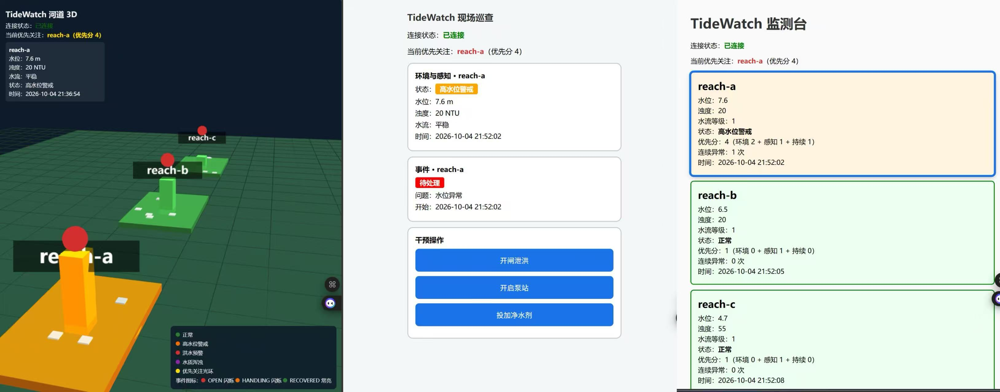
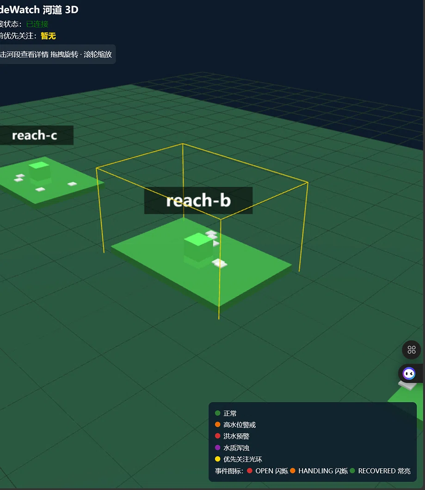
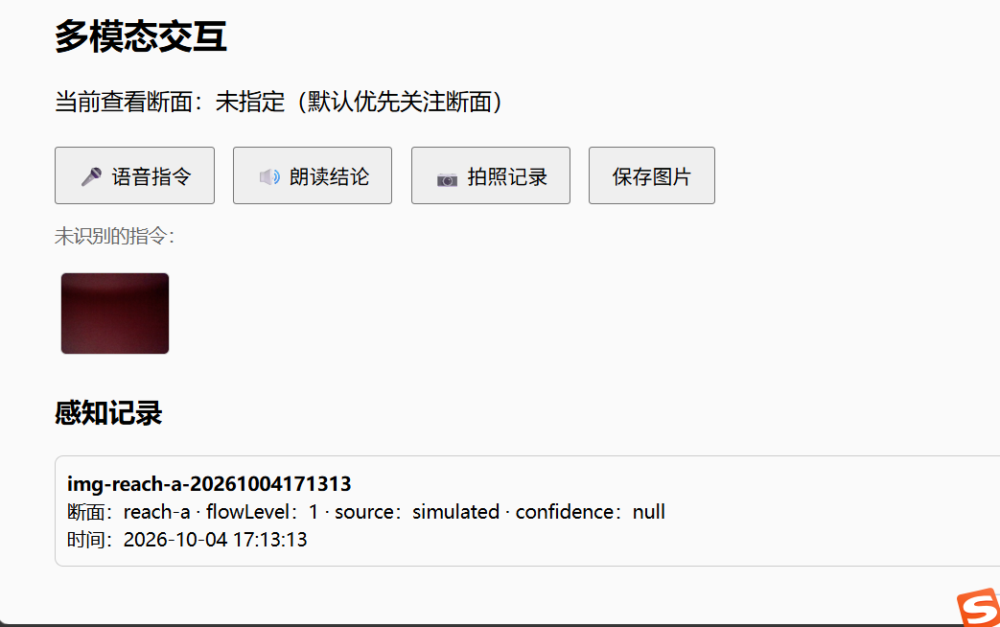
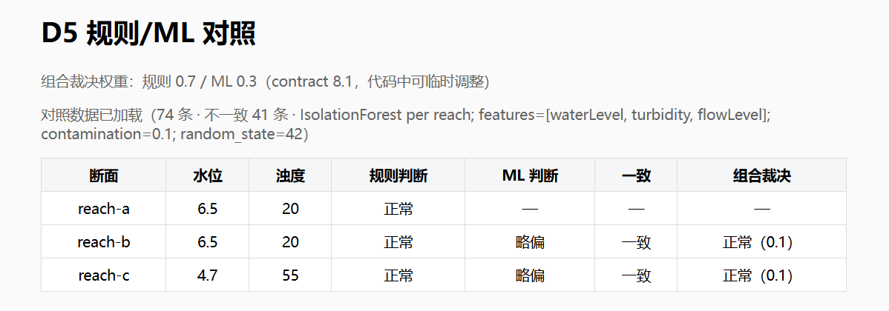
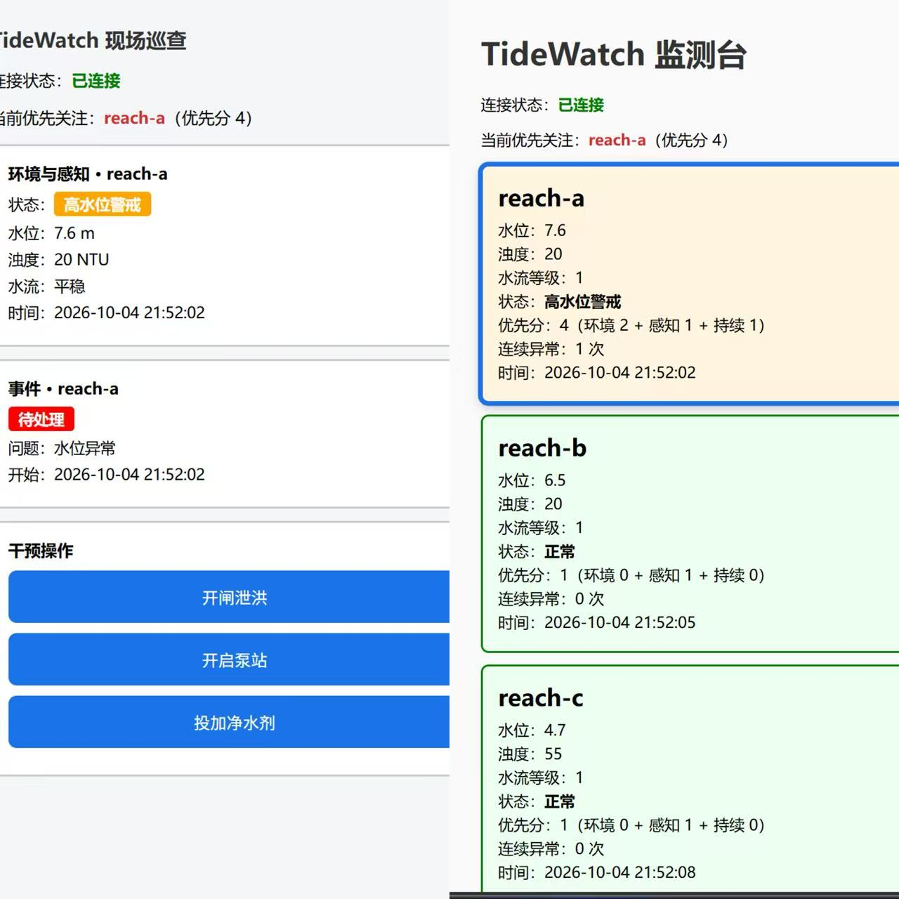
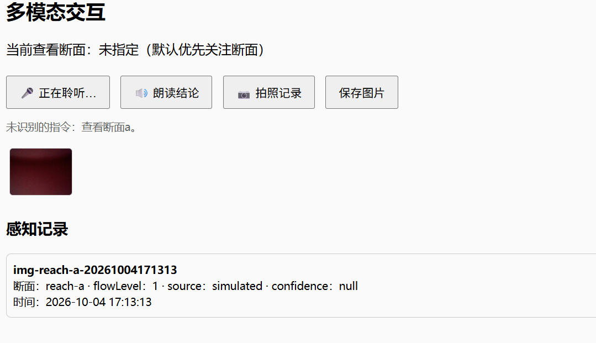

# TideWatch

## 河道水位与水质智能监测、预警与多端协同系统

**作者：Wuqi**
**日期：2026-10-04**

---

# 项目问题与目标

- 三断面水位/水质靠人工巡检，响应滞后
- 告警只看当下值，没有处置闭环
- 值班室、现场、调度三拨人信息割裂
- 目标：自动判级 → 事件流转 → 多端协同 → 数据留痕

> **结论**：一条实时数据流，驱动三端一致行动；异常从发现到恢复全程留痕。

---

# 最终产品长什么样

- **Web 监测台**：三断面总览、事件列表、规则/ML 对照
- **移动端**：只看优先关注断面，大按钮一键干预
- **3D 河道**：水位柱、风险色、事件图标，空间定位
- **离线分析链**：CSV → 统计报告；CSV → ML 对照

  

> **结论**：同一份 MQTT 消息，三端各自按分工渲染，数据不串线。

---

# 系统架构

```
simulator.py ──> Mosquitto(1883/8083) ──> Web / 移动端 / 3D（WS 订阅）
      │ append
      ▼
tidewatch_history.csv ──> analyze.py ──> report.html
                      └─> ml_detect.py ──> web/d5_compare.json
```

- Broker 双监听：1883 MQTT + 8083 WebSocket
- QoS 1，匿名访问，三端订阅 `tidewatch/+/state`
- 前端库（mqtt.js/three.js）全部本地化

> **结论**：零外网依赖；实时链与离线链共享同一数据源。

---

# 核心数据与判级规则

- 六字段 JSON：reachId / waterLevel / turbidity / flowLevel / status / time
- 判级：≥8.5 洪水预警；≥7.0 高水位警戒；≥60 水质浑浊
- status 只能由规则计算，任何端都不可手填
- 三 Topic：state / event/update / intervention

> **结论**：reachId 是唯一状态 key——三断面从源头到界面都不串线。

---

# 事件状态机与消息健壮性

```
异常数据 → OPEN → 人工干预 → HANDLING → 新数据满足恢复 → RECOVERED(锁定)
```

- 恢复只能由新数据触发，按钮不能直接恢复
- 去重双键：message_id 优先，载荷哈希兜底
- 乱序丢弃、迟到不回滚、RECOVERED 锁定
- 每断面最多一个未关闭事件

> **结论**：状态机单调可推导——任何一条消息到达，行为都有唯一答案。

---

# D1–D5 概览

- **D1**：三断面稳定在线，一条消息三端同步
- **D2**：优先分自动标出当前最该看的断面
- **D3**：事件全生命周期 + 去重/乱序/迟到
- **D4**：故障注入 → 拒绝统计 → 快速恢复
- **D5**：固定规则 × IsolationForest 双视角对照



> **结论**：从数据到决策，D1–D5 拼出完整监测闭环。

---

# E1/E2/E3 概览

- **E1**：Three.js 3D 河道，水位柱/水流动画/事件图标
- **E2**：语音指令、结论朗读、现场拍照 + 感知记录
- **E3**：事件与干预跨端广播，两端状态实时一致

 

> **结论**：三端不再是三张孤立的页面，而是一套协同系统。

---

# 一个真实故障与修复（D4）

- 故障①：消息发到不存在的 Topic
- 故障②：载荷是损坏的 JSON
- 现象：拒绝计数 +1、显示拒绝原因，状态零污染
- 双保险：Topic 校验 + 载荷带 2000 年时间戳

 

> **结论**：故障演示不破坏演示环境，发一条正确消息即恢复。

---

# 一个规则/ML 对照案例（D5）

- 每个断面独立训练 IsolationForest（waterLevel/turbidity/flowLevel）
- 案例①：规则正常 + ML 明显异常 → **需人工复核**
- 案例②：规则洪水预警 + ML 略偏 → 历史异常被学成常态
- 组合裁决：规则 0.7 + ML 0.3 加权打分

> **结论**：规则查绝对阈值，ML 查"偏离自身历史"——互补而非替代。

---

# 多端协同机制（E3）

- 事件广播 `event/update`：Web 是唯一权威端
- 干预广播 `intervention`：两端平等发起
- 单调守卫 + 去重 + 幂等，杜绝状态分叉
- 移动端永不发 event/update，结构上排除环路

> **结论**：谁在现场谁处置，两端最终状态一致。

---

# 自主设计与作品亮点

- 前端库本地化 + 加载守卫，摆脱 CDN 依赖
- 测试面板 + 手动发布表单，全流程徒手可复现
- 故障载荷带旧时间戳，双保险不污染系统
- CSV 行粘连自动修复，读取层容错
- 构造样本标注，保证对照案例可复现

> **结论**：不止完成任务书，更关注系统可复现、可演示、可解释。

---

# 已知限制与后续想法

- flowLevel 来源为 simulated，confidence 恒为 null（如实标注）
- 事件/照片为页面内存态，刷新即重置
- ML 每断面样本量小，存在误报/漏报空间
- 后续：真实视觉感知、持久化后端、云端部署

> **结论**：限制如实声明；演进路径已经想清楚。

---

# 谢谢

TideWatch · 河道水位与水质智能监测、预警与多端协同系统

演示环境：Mosquitto 2.1.2 · Python 3.13 · Chrome/Edge
